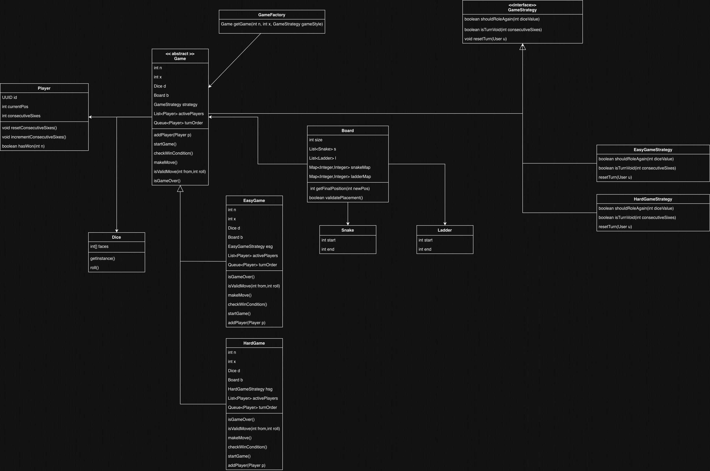

# Snake & Ladder — Low Level Design

A console-based Snake and Ladder game built in **Java** demonstrating clean object-oriented design principles including design patterns.

---

## Architecture & Design Patterns

### UML Class Diagram



### Design Patterns Used

| Pattern | Implementation | Purpose |
|---------|---------------|---------|
| **Factory** | `GameFactory` | Creates `Game` instances with the appropriate board and strategy based on game type |
| **Strategy** | `GameStrategy` interface with `EasyGameStrategy` and `HardGameStrategy` | Encapsulates game rules (re-roll on 6, consecutive sixes penalty) so game modes can vary independently |
| **Singleton** | `Dice` (thread-safe double-checked locking) | Ensures a single shared dice instance across the entire game |
| **Template Method** | `Game` (abstract) → `EasyGame` / `HardGame` | Base class defines the game lifecycle (`startGame`, `checkWinCondition`, `isGameOver`); subclasses implement `makeMove()` |

---

## Project Structure

```
src/main/java/org/example/
├── Main.java                          # Entry point — reads input, creates & starts game
├── factory/
│   └── GameFactory.java               # Factory to create Game with random snakes & ladders
├── game/
│   ├── Game.java                      # Abstract base class — game lifecycle & shared logic
│   ├── EasyGame.java                  # Easy mode — roll again on 6, no penalty
│   └── HardGame.java                  # Hard mode — 3 consecutive sixes voids the turn
├── models/
│   ├── Board.java                     # Board with snake/ladder maps & placement validation
│   ├── Dice.java                      # Singleton 6-sided dice
│   ├── Player.java                    # Player with position & consecutive sixes tracking
│   ├── Snake.java                     # Snake entity (head → tail)
│   └── Ladder.java                    # Ladder entity (bottom → top)
└── strategy/
    ├── GameStrategy.java              # Interface — shouldRollAgain, isTurnVoid, resetTurn
    ├── EasyGameStrategy.java          # Roll again on 6, turn never voided
    └── HardGameStrategy.java          # Roll again on 6, turn voided on 3 consecutive sixes
```

---

## Game Modes

### Easy Mode (`EasyGameStrategy`)
- Rolling a **6** grants an extra turn
- No penalty for consecutive sixes

### Hard Mode (`HardGameStrategy`)
- Rolling a **6** grants an extra turn
- Rolling **3 consecutive sixes** voids the entire turn — the player stays at their position and the turn passes to the next player

---

## How to Run

### Prerequisites
- **Java 22+**
- **Maven**

### Build & Run

```bash
# Clone the repository
git clone <repo-url>
cd SnakesAndLadders

# Compile
mvn compile

# Run
mvn exec:java -Dexec.mainClass="org.example.Main"
```

### Sample Interaction

```
Enter the size of the board
10
Enter the no. of players playing the game:
3

=== Game Started! ===
Board size: 10x10 (100 cells)
Players: 3
Snakes: 10, Ladders: 10

Snake: 45 -> 12
Ladder: 8 -> 52
...

<UUID> rolled a 4 (currently at 0)
  <UUID> moved to 4
<UUID> rolled a 6 (currently at 0)
Stepped on ladder
  <UUID> moved to 52
  <UUID> gets another turn!
...
*** <UUID> wins! ***

=== Game Over! ===
```

---

## Board Validation

The `Board.validatePlacement()` method ensures:

- **No snake/ladder at positions 1 or n²** — start and winning cells are always safe
- **Vertical placement** — snakes and ladders must span different rows on the board
- **No overlap** — a snake head and ladder bottom cannot occupy the same cell
- **No cycles** — prevents snake-tail → ladder-bottom → ladder-top → snake-head loops

If validation fails, the `GameFactory` automatically regenerates the board.

---

## Key Classes

### `Game` (Abstract)
Manages the game lifecycle: adding players, running the game loop with a 10,000-turn safety valve, and declaring results. Subclasses implement `makeMove()`.

### `Board`
Maintains two `HashMap<Integer, Integer>` maps — one for snakes (head → tail) and one for ladders (bottom → top). The `getFinalPosition()` method resolves a player's landing position through any snake or ladder.

### `Dice` (Singleton)
Thread-safe singleton using double-checked locking. Generates random values 1–6 using `java.util.Random`.

### `Player`
Tracks the player's current position and consecutive sixes count (used in hard mode).

### `GameFactory`
Randomly places `n` snakes and `n` ladders on the board, ensuring no collisions with occupied positions. Validates the board and regenerates if invalid.

---

## Relationships

- **`Game` → `Board`**: Aggregation (has-a) — Game uses a Board
- **`Game` → `Player`**: Aggregation — Game manages a list of Players
- **`Game` → `Dice`**: Aggregation — Game uses the singleton Dice
- **`Game` → `GameStrategy`**: Aggregation — Game delegates rules to a Strategy
- **`Board` → `Snake`, `Ladder`**: Aggregation — Board contains Snakes and Ladders
- **`EasyGame`, `HardGame` → `Game`**: Inheritance (is-a)
- **`EasyGameStrategy`, `HardGameStrategy` → `GameStrategy`**: Implementation (realizes)
